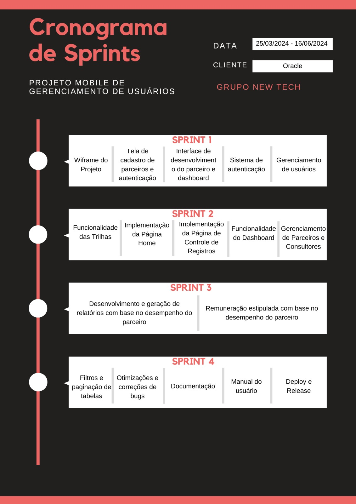
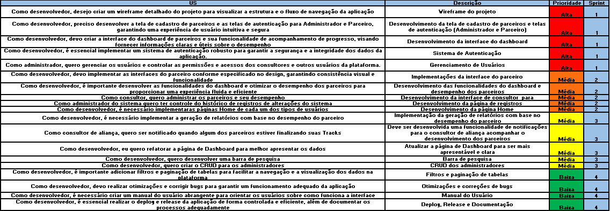
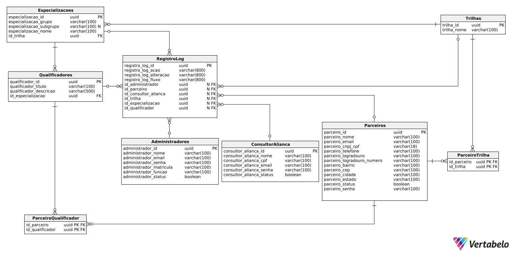

<h1> New Tech </h1>

<h2> O Projeto 💼 </h2>

Desenvolver um sistema de gestão de parceiros para a Oracle. Este sistema será responsável por
cadastrar novos parceiros, gerenciar atualizações de informações, acompanhar o desenvolvimento
de conhecimento dos parceiros e fornecer relatórios relevantes – em plataforma mobile.

 

<h2>Objetivo do Projeto 📌</h2>

<h3>Objetivos do Sistema: </h3>

<b>1. Centralizar e automatizar as atividades relacionadas à gestão de parceiros de negócios.
 </b>

<b>2. Proporcionar um local único para cadastrar, editar, excluir e monitorar todos os dados relevantes
do relacionamento com os parceiros.
 </b>

<b>3. Melhorar a eficiência operacional da organização.
 </b>

<b>4. Auxiliar na consulta e visualização de dados relevantes do relacionamento com os parceiros.
 </b>

<b>5. Visualizar um modelo de gestão de desempenho e/ou dados dos parceiros.  
 </b>
 
  
 
<h3> Requisitos Funcionais: </h3>

 :heavy_check_mark: Desenvolver uma interface de cadastro de parceiros; 

 :heavy_check_mark: Desenvolver uma interface de desenvolvimento de parceiros;  

 :heavy_check_mark: Desenvolver um Dashboard de indicadores de desempenho de parceiros; 

 :hourglass: Desenvolver um Relatório Analítico de parceiros por produto implementado.

  

<h3> Requisitos Não Funcionais: </h3> 

 
 :hourglass: Manual do Usuário; 

 
 :hourglass: Documentação técnica da estruturação do sistema; 

 
 :hourglass: Documentação API – Application Programming Interface; 

 
 :heavy_check_mark: Modelagem de Banco de Dados ou Arquivo de dados. 

  
  
 
<h2>Cronograma das Sprints 📆</h2>
 
 

 
 
<h2>Demonstração completa de nosso sistema 💻</h2> 
<h3> Video Sprint Review 1: <a href="https://youtu.be/Wta7mGWDcBE?si=ktAhCTTZvtMGwAHO">Clique aqui</a></h3>
<h3> Video Sprint Review 2: <a href="https://youtu.be/CRgsnU3LqM0">Clique aqui</a></h3>

 
 

<h2>Tecnologias Utilizadas 🔧</h2>
 
● Front-end: React-Native; 
● Back-end: Node.js; 
● Linguagem de Programação: TypeScript; 
● Banco de Dados: PostgreSQL, MongoDB; 
● Ferramentas: Git, GitHub, Visual Studio Code, Figma, Canva. 

               

 
 

<h2>Backlog 📊</h2> 
 O product backlog é uma lista ordenada que tem como função documentar de forma clara todos os requisitos do desenvolvimento de um projeto. Itens que precisem de maior refinamento geralmente têm uma importância menor e ficam mais abaixo no Product Backlog.  
 

 
 
 
<h2>Modelo de dados📑</h2> 
 Um modelo de banco de dados mostra a estrutura lógica de um banco de dados, incluindo as relações e restrições que determinam como os dados podem ser armazenados e acessados.
 

<h5>Modelo Lógico<h5>

 

<h2>Equipe 👾</h2>
 
 Nome|Função|Github|Linkedin 
-----|------|------|---------
Eliézer Lopes       |Scrum Master|[@Github](https://github.com/EliezerLopes1)|[@Linkedin](https://www.linkedin.com/in/eli%C3%A9zer-lopes-b89a4124a)
Mariana Veloso      |Product Owner|[@Github](https://github.com/Marih2210)|[@Linkedin](https://www.linkedin.com/in/mariana-veloso-979436231)
Nicolas Pereira     |Desenvolvedor|[@Github](https://github.com/NicolasPereira06)|[@Linkedin](https://www.linkedin.com/in/nicolaspereira06/)
Thalles Torres      |Desenvolvedor|[@Github](https://github.com/thallestorres)|[@Linkedin](www.linkedin.com/in/thalles-torres-83449a285)
Francisco Quirino   |Desenvolvedor|[@Github](https://www.github.com/ciscoquirino)|[@Linkedin](https://www.linkedin.com/in/francisco-quirino )
Gabriel Angelis     |Desenvolvedor|[@Github](https://github.com/GabrAngelis)|[@Linkedin](https://www.linkedin.com/in/gabriel-luis-de-angelis-b64816237/)
Douglas Queiroz     |Desenvolvedor|[@Github](https://github.com/douglaswe)|[@Linkedin](https://www.linkedin.com/in/douglas-queiroz-3b9a72212/)
 
 
